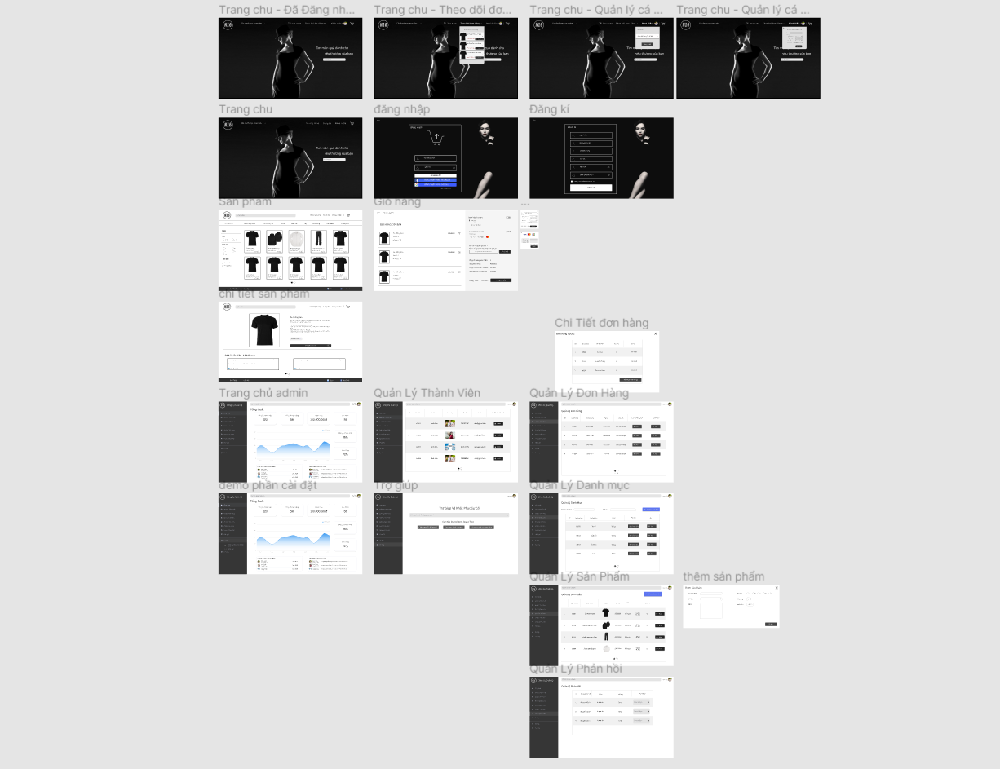
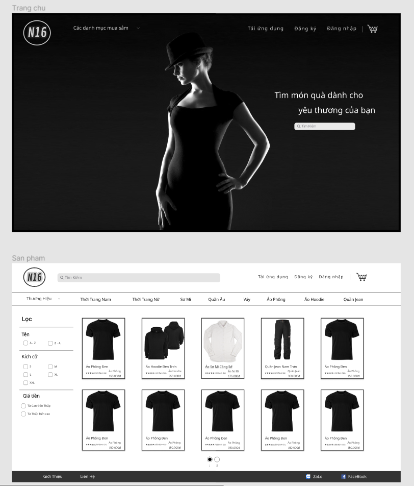
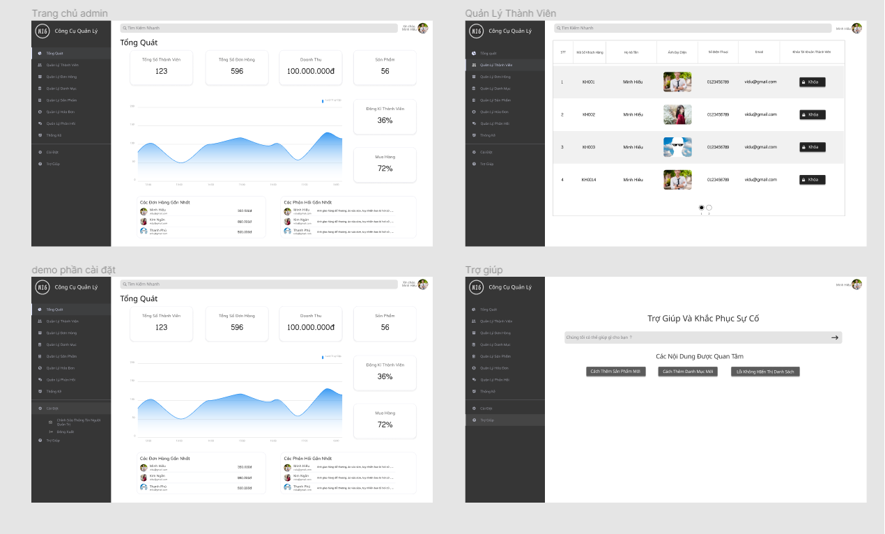
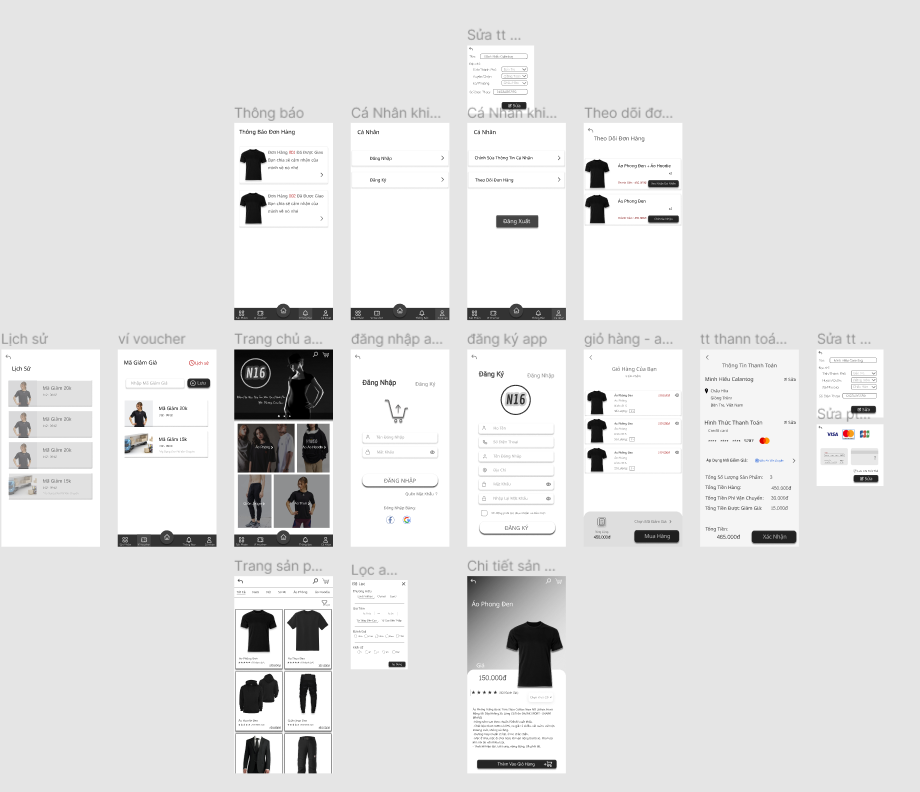
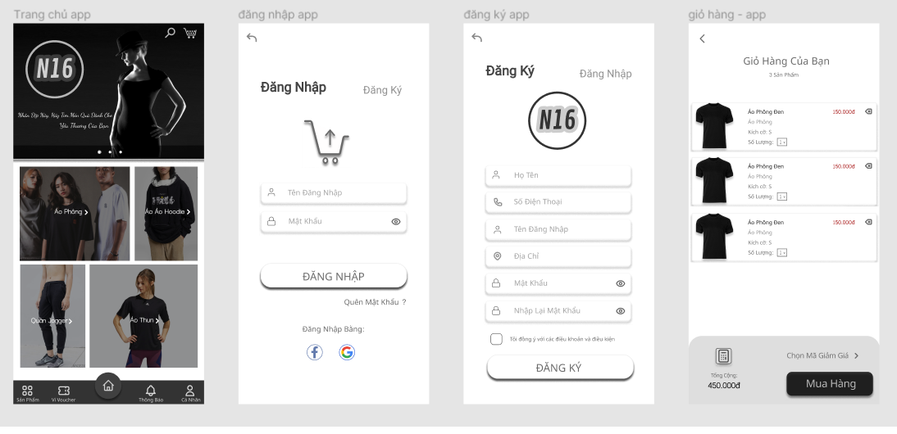

# Thiết kế giao diện - Web/app của cửa hàng bán quần áo


 

## Thành viên nhóm

| STT |    MSSV    | Họ và tên             |
| :-: | :--------: | --------------------- |
|  1  | 3119410439 | Minh Hiếu Calan Tog   |
|  2  | 3119410452 | Bùi Minh Trí   |
|  3  | 3119410437 | Lê Ngọc Toàn   |
|  4  | 3119410431 | Nguyễn Vĩnh Tiến   |


## Yêu Cầu:

- Sử dụng Balsamiq và Figma để thiết kế giao diện của web/app cửa hàng bán quần áo <br/>


## Hướng dẫn cài đặt

```
Sử dụng phần mềm Balsamiq và Figma để chạy các file tương ứng.
```
## Link demo: </br>

1. Figma-app: https://www.figma.com/file/iC8M0nQhsckNnneBxEugDE/app-Figma?node-id=0%3A1&t=nKXJrCgGL8ttlUMj-1 </br>

2. Figma-web: https://www.figma.com/file/CJVr9WAZoiT1JQDz8NgMFI/web-Figma?node-id=0%3A1&t=z0mguDbFPuQwqD64-1 </br>


## Một số giao diện của website





